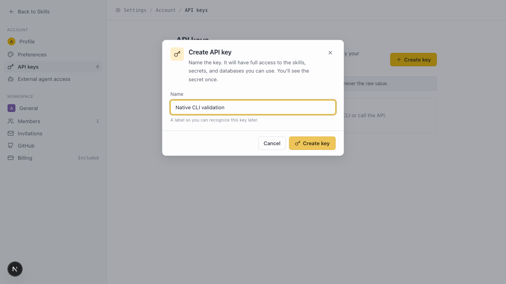
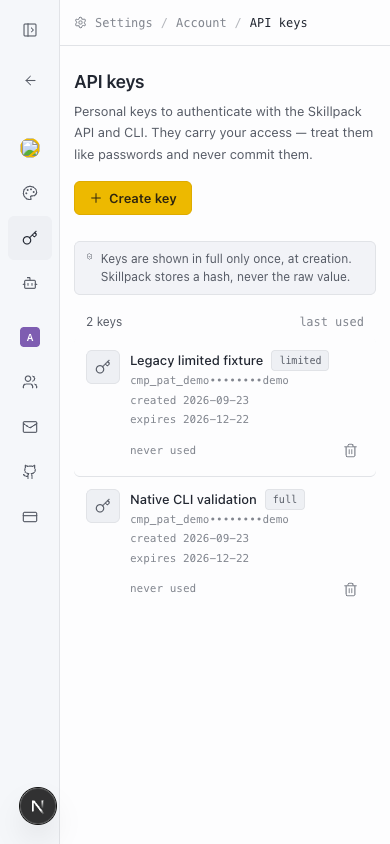

# Native Skillpack CLI

The release archive provides `skillpack` and the backwards-compatible `skillpack-runtime` collector for macOS, Linux and Windows, on amd64 and arm64. Management commands need neither Python nor Node. The OpenCode bridge runs in its host's JavaScript runtime.

## Install and connect

Download `install.sh` or `install.ps1` from the official `runtime-v0.2.0` GitHub release and run it with the platform shell. Release generation injects the expected digest for every target into the installer. The checked-in template intentionally refuses to install before that generation step. Installers download only over HTTPS and validate the archive before executing its binaries.

The stable command is `~/.local/bin/skillpack` on POSIX or `%LOCALAPPDATA%\Skillpack\bin\skillpack.exe` on Windows. Add that directory to your shell PATH if needed. Version slots and the installation receipt live under the private OS configuration directory's `skillpack/cli` subdirectory. `SKILLPACK_HOME` overrides the management state root; `SKILLPACK_RUNTIME_HOME` independently overrides usage state. Defaults match Go's user configuration directory: Application Support on macOS, APPDATA on Windows, XDG_CONFIG_HOME on Linux.

Create a named API key in settings, then enter it in the hidden prompt:

```sh
skillpack auth login --api-url https://skillpack.app/v1
skillpack auth status --json
skillpack setup --tools codex,claude-code,opencode
```

For automation, inject `SKILLPACK_API_KEY` and `SKILLPACK_API_URL` through the runner's secret environment. The CLI never accepts a key argument. `--token-stdin` supports a trusted private pipe. New human keys have all current capabilities; existing keys retain their original scope set, expiry and revocation rules. All organization membership, secret audience and personal database access checks still apply.

`--profile NAME` selects a saved connection. An API override cannot send its saved key to another instance. Environment keys remain ephemeral. Logout only removes local credentials; refresh explicitly rotates a saved key and does not widen capabilities.

## Packages and repository installs

```sh
skillpack install plan-pr --scope project --project ./repository
skillpack update --all --dry-run --json
skillpack update --all --json
skillpack sync --frozen --project ./repository --json
```

Project installs use `.agents/skills` plus managed host discovery copies and relative paths in `.companion/skills.lock.json`. Commit packages and that lock to make them discoverable after a cloud clone. Runtime lock files and `.skillpack-stage-*` / `.skillpack-backup-*` files are temporary coordination artifacts; do not commit them. No AGENTS.md or CLAUDE.md edit is needed.

An exact `--version` pins a skill; `--pin` pins the current version. Updates preserve pins and local edits, and report each root independently. Each root's dependency closure, secret projections and lock change are staged before activation. Recovery rolls back an interrupted transaction before starting another. Never interpret an overall nonzero exit as success merely because another root updated.

Frozen sync verifies committed copies offline and can restore a missing copy from another verified target. If every copy is missing, it needs credentials matching the locked API and organization to download the exact checksum and version. It never changes the lock. Secret and database readiness is separate from package availability.

`import-lock ./companion.lock --project .` imports an old v1 export after checking its existing files. It preserves the source and refuses to overwrite an already-populated destination lock.

Public installs use `install --public TOKEN --version VERSION`. The CLI checks the exact public ZIP size and checksum, then installs only its root package. It reports declared prerequisites rather than fetching private dependencies or secrets. It requires a key with public installation capability and never reports a private workspace installation for that release.

## API, secrets and databases

Use `skills validate FOLDER`, `skills publish FOLDER --scope org|personal`, `skills list`, `skills info SLUG` and `skills versions SLUG`. Packages use the shared v2 manifest schema; canonical archive checksums have an independent TypeScript oracle. Server validation remains authoritative for business rules.

The shared operation registry powers `api METHOD /v1/path --input FILE|-`. JSON output and exit codes support agents. Generic API access excludes credential issuance and plaintext secret grant redemption; dedicated secret commands keep values out of output.

Use `secrets create`, `bind`, `configuration` and `sync` with JSON stdin/private files. Secret values are projected into private `~/.companion/secrets/<workspace>/<skill>/.env` files, with value-free state metadata. A one-use retrieval grant is never saved or replayed. Missing required bindings prevent package activation.

`db query SLUG --input FILE` and `db execute SLUG --input FILE` take `sql`, `params`, `audience` and an authorized personal `realm_id` when needed. Writes are not automatically retried after an ambiguous network failure. A full key cannot bypass database feature flags or another member's private realm.

Exit codes: 0 success, 1 local I/O/internal failure, 2 usage, 3 authentication, 4 missing resource, 5 validation, 6 conflict/partial update, 7 authorization, 8 network/server failure, 9 local drift. Errors omit response bodies and credentials.

## Runtime and self-update

`doctor --json` checks both user and project installs and shows credentials, package state and usage diagnostics separately. It reports missing required local secrets by name, without revealing their values. Locally present packages and secrets do not prove remote database access: that readiness remains `not_verified` until a functional check succeeds. `setup` preserves unrelated hooks and requires the official runtime companion beside the CLI for OpenCode. Codex approval remains in `/hooks`; configured hooks are not proof of observation. `usage telemetry disable` keeps the existing persistent opt-out behavior.

`self update` selects a newer stable runtime release, verifies its pinned Ed25519 signature and six-target manifest, checks the archive digest, and self-tests the new binary before activation. It preserves old version slots. An occupied or conflicting slot is reported for inspection, never overwritten blindly. On Windows, activation is delegated to the verified new executable after the foreground process exits, and the command reports `activation_pending`. The launcher replacement is atomic; a sharing lock leaves the old launcher intact. Check `doctor` and `--version` afterward; close other Skillpack processes and retry if activation remains locked.

Legacy Python/MJS files stay in the management package so an already-running 1.118.2 bootstrap can finish after replacing its folder. New prompts and native commands do not execute that payload. Migration requires a first API-key login; Agent Auth references and private keys are not copied or silently converted.

## Verification

`go test ./...` under `runtime/` covers native contracts, archive checksums, traversal rejection, private projection, offline clone restoration and interrupted transaction recovery. Existing native CI jobs build/test both executables for all six targets. The build-time contract generator supports `--check` to detect registry/schema drift.

For the full-process API acceptance test, start the isolated `scripts/dev-conductor.sh` stack, build the CLI, and run `apps/api/test/integration/nativeCli.integration.test.ts` with explicit disposable `DATABASE_URL`, `COMPANION_INTEGRATION_TESTS=1`, loopback `SKILLPACK_NATIVE_API_URL` and absolute `SKILLPACK_NATIVE_BINARY`. It publishes a synthetic skill, projects a secret, writes and reads real SQLite through remote storage, then checks restricted and revoked keys with no interpreters in PATH. This opt-in test is separate from the default database suite.

## API-key interface

New keys use the full capability set without a scope picker. Existing limited keys remain labelled separately. These local validation captures use synthetic data.




